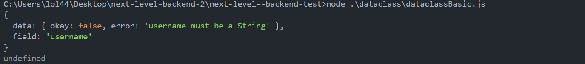

# Data Class 
Data Class is a class that can handle validation data and database data at the same time.It will work as a table at one time,but it can also work as a validation class.

First let's think of a form.One of the things comes to your mind when your hear the word `form` is how to do validations right?.So Instead of writing validations again and again you can design the pattern , and the validation will be done automatically. That's what data class does.

Let's see a basic example of a `User` with an username.In Order to do so,first we are going to import the `DataClass` from the library.


```javascript
const {DataClass, validators, DataClassFactory} = require("fast-express-backend/dataclasses")
```

Notice : We have imported some external functions.There are important.But for now you can just skip them expect the `DataClass`.

```javascript
class UserDataClass extends DataClass {
        username = {
            type:String,
            validations:[validators.is_required("Username is required")]
        }
}
```

The class you gonna create must be extended from the `DataClass`.Next your gonna give an attribute.`username`,`name` or anything you like.It must be a simple object. The object must contains it type.Javascript Basic Types are supported.Then you can put the validations as a list.The predefined validations are in `validators`.You can build your own if you like.Then let's test this in action.Create the runner function and let's see what the response is.


```javascript

const { DATABASE_TYPES } = require("fast-express-backend/databases")
const {DataClass, validators, DataClassFactory} = require("fast-express-backend/dataclasses")

class UserDataClass extends DataClass {
        username = {
            type:String,
            validations:[validators.is_required("Username is required")]
        }
}

const user = new UserDataClass()
user.init({'username':null})

async function runner(){
    const response = await user.validate()
    console.log(response)
}

runner().then(e => console.log(e)).catch(error => console.error(error))

```

You should get a response like this.

